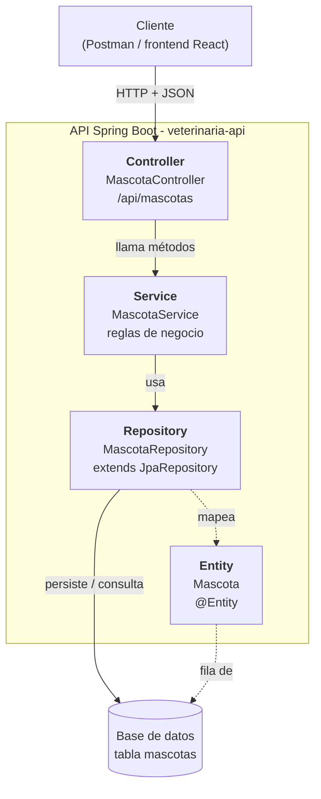

# Semana 6 - Arquitectura en capas de una API

Actividad opcional de refuerzo.

## Caso elegido

**API de una veterinaria - gestión de mascotas.**
La clínica necesita registrar las mascotas que atiende (nombre, especie, raza, edad y dueño),
consultarlas, actualizar sus datos y darlas de baja. Este mismo caso se sigue construyendo en
las semanas 7 (entity + repository), 8 (CRUD REST) y 9 (Swagger + Postman).

## 1. Diagrama de capas



Versión en texto (por si el diagrama no se muestra):

```text
Cliente (Postman / React)
   │  HTTP + JSON
   ▼
Controller   → MascotaController   (/api/mascotas)
   │
   ▼
Service      → MascotaService      (reglas de negocio)
   │
   ▼
Repository   → MascotaRepository   (JpaRepository<Mascota, Long>)
   │
   ▼
Entity       → Mascota  ⇄  tabla "mascotas" en la base de datos
```

Regla del flujo: **cada capa solo habla con la capa de abajo**. El controller nunca usa el
repository directamente y la base de datos nunca se toca desde el controller.

## 2. Responsabilidad de cada capa en este caso

| Capa | Clase | Responsabilidad | Lo que NO hace |
| --- | --- | --- | --- |
| **Controller** | `MascotaController` | Recibe las peticiones HTTP en `/api/mascotas`, lee el `id` de la URL y el JSON del body, llama al service y devuelve la respuesta con el código HTTP correcto (200, 201, 204, 404). | No tiene reglas de negocio ni consultas a la base de datos. |
| **Service** | `MascotaService` | Aplica las reglas del negocio: verificar que la mascota exista antes de actualizar o borrar (si no, error 404), validar que la edad no sea negativa, normalizar datos (por ejemplo la especie) y decidir qué métodos del repository usar. | No conoce HTTP (no sabe de rutas ni de códigos de estado). |
| **Repository** | `MascotaRepository` | Acceso a datos. Extiende `JpaRepository<Mascota, Long>`, que ya trae `save`, `findAll`, `findById`, `deleteById`. Agrega consultas propias como `findByEspecieIgnoreCase`. | No valida reglas de negocio. |
| **Entity** | `Mascota` | Representa la tabla `mascotas`. Cada atributo (`id`, `nombre`, `especie`, `raza`, `edad`, `nombreDueno`) es una columna y cada objeto es una fila. | No tiene lógica, solo datos y su mapeo. |

## 3. Endpoint de ejemplo y su recorrido por las capas

**`PUT /api/mascotas/5`** — actualizar los datos de la mascota con id 5.

Body enviado:

```json
{
  "nombre": "Luna",
  "especie": "Perro",
  "raza": "Labrador",
  "edad": 4,
  "nombreDueno": "Carlos Pérez"
}
```

Recorrido:

1. **Controller** — `MascotaController.actualizar(5, body)` recibe la petición, toma el `id = 5`
   de la URL y convierte el JSON en un objeto `Mascota`. Llama a `mascotaService.actualizar(5, datos)`.
2. **Service** — `MascotaService.actualizar` pide al repository la mascota con `findById(5)`.
   - Si **no existe**, lanza una excepción que termina en **404 Not Found**.
   - Si existe, copia los nuevos datos sobre la mascota encontrada y llama a `save(...)`.
3. **Repository** — `MascotaRepository.save(mascota)` (heredado de `JpaRepository`) genera el
   `UPDATE mascotas SET ... WHERE id = 5`.
4. **Entity** — `Mascota` es el objeto que JPA traduce a la fila de la tabla `mascotas`.
5. La respuesta vuelve hacia arriba: el service devuelve la mascota actualizada y el controller
   responde **200 OK** con el JSON de la mascota.

**¿Por qué es un buen ejemplo?** Pasa por las cuatro capas y además muestra la separación de
responsabilidades: la decisión de "¿existe o no?" está en el **service** (regla de negocio),
mientras que convertirla en un **404** es tarea del **controller** / manejo de errores de la API.

## Endpoints previstos (se implementan en la semana 8)

| Acción | Método | URL |
| --- | --- | --- |
| Listar mascotas | GET | `/api/mascotas` |
| Obtener una mascota | GET | `/api/mascotas/{id}` |
| Buscar por especie | GET | `/api/mascotas?especie=Perro` |
| Crear mascota | POST | `/api/mascotas` |
| Actualizar mascota | PUT | `/api/mascotas/{id}` |
| Eliminar mascota | DELETE | `/api/mascotas/{id}` |
