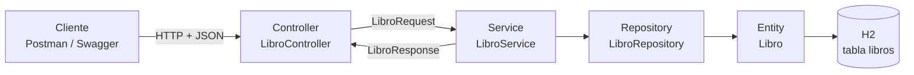

# Actividad calificable · Corte 2 — API REST con Spring Boot

**Desarrollo Fullstack · Semana 9 · CORHUILA 2026-B**
**Estudiante:** Juan Diego Jiménez Horta — GitHub: [ItzJunixs](https://github.com/ItzJunixs)

API REST para gestionar los **libros de una biblioteca**: registrar, consultar, actualizar y
eliminar libros, con persistencia JPA, documentación Swagger y pruebas en Postman.

## Contenido de la carpeta

```text
c2-activity/
├── README.md                                   # este documento
├── biblioteca-api/                             # proyecto Spring Boot (Maven)
├── postman/biblioteca-api.postman_collection.json
└── evidencias/                                 # capturas de Swagger y Postman
```

## Tecnologías

| Herramienta | Uso |
| --- | --- |
| Java 17+ | Lenguaje |
| Spring Boot 3.5 | Framework (Web, Data JPA, Validation) |
| H2 | Base de datos en memoria |
| springdoc-openapi 2.8 | Swagger UI / OpenAPI 3 |
| Postman | Pruebas de los endpoints |
| Maven | Construcción y dependencias |

## 1. Arquitectura en capas



```text
biblioteca-api/src/main/java/co/edu/corhuila/biblioteca/
├── BibliotecaApiApplication.java   # arranque + datos de OpenAPI
├── controller/LibroController.java # rutas /api/libros y códigos HTTP
├── service/LibroService.java       # reglas de negocio (404, ISBN único -> 409)
├── repository/LibroRepository.java # JpaRepository + consultas por método
├── entity/Libro.java               # @Entity -> tabla "libros"
├── dto/LibroRequest.java           # body de POST/PUT con validaciones (-> 400)
├── dto/LibroResponse.java          # lo que devuelve la API
└── exception/
    ├── RecursoNoEncontradoException.java  # -> 404
    ├── ConflictoException.java            # -> 409
    └── ManejadorErrores.java              # @RestControllerAdvice, JSON de error uniforme
```

| Capa | Responsabilidad |
| --- | --- |
| **Controller** | Recibe la petición, valida el body con `@Valid`, llama al service y responde con el código HTTP correcto (200, 201, 204). |
| **Service** | Reglas de negocio: verifica que el libro exista (si no, 404), que el ISBN no se repita (si se repite, 409) y convierte entre DTO y entity. Es `@Transactional`. |
| **Repository** | Acceso a datos con `JpaRepository<Libro, Long>` y consultas por método: `findByAutorContainingIgnoreCase`, `existsByIsbn`, `existsByIsbnAndIdNot`. |
| **Entity** | `Libro` mapeado con `@Entity`, `@Id`, `@GeneratedValue` y `@Column` (el ISBN es `unique`). |

Se usan **DTOs** (`LibroRequest` / `LibroResponse`) para no exponer la entity directamente y para
concentrar las validaciones de entrada.

## 2. Cómo ejecutar

**Requisitos:** JDK 17 o superior y Maven (o IntelliJ IDEA, que trae Maven integrado).

**Opción A — IntelliJ IDEA**

1. *File → Open* y elegir la carpeta `biblioteca-api` (se importa como proyecto Maven).
2. Esperar a que descargue las dependencias.
3. Ejecutar la clase `BibliotecaApiApplication`.

**Opción B — Consola**

```bash
cd 09-week/02-optional-activity/c2-activity/biblioteca-api
mvn spring-boot:run
```

Cuando aparezca `Started BibliotecaApiApplication`, la API está disponible en:

| Recurso | URL |
| --- | --- |
| API | http://localhost:8080/api/libros |
| Swagger UI | http://localhost:8080/swagger-ui.html |
| OpenAPI (JSON) | http://localhost:8080/v3/api-docs |
| Consola H2 | http://localhost:8080/h2-console (JDBC URL `jdbc:h2:mem:biblioteca`, usuario `sa`, sin contraseña) |

Al iniciar se cargan 3 libros de ejemplo (`data.sql`, ids 1 a 3). La base es en memoria: al
reiniciar la aplicación los datos vuelven a su estado inicial.

## 3. Endpoints

Base URL: `http://localhost:8080`

| # | Método | URL | Descripción | Body | Éxito | Errores |
| --- | --- | --- | --- | --- | --- | --- |
| 1 | `GET` | `/api/libros` | Lista todos los libros | — | 200 | — |
| 1b | `GET` | `/api/libros?autor=garcía` | Lista filtrando por autor | — | 200 | — |
| 2 | `GET` | `/api/libros/{id}` | Obtiene un libro | — | 200 | 400, 404 |
| 3 | `POST` | `/api/libros` | Crea un libro | `LibroRequest` | 201 + `Location` | 400, 409 |
| 4 | `PUT` | `/api/libros/{id}` | Actualiza un libro | `LibroRequest` | 200 | 400, 404, 409 |
| 5 | `DELETE` | `/api/libros/{id}` | Elimina un libro | — | 204 | 404 |

**Body (`LibroRequest`)**

```json
{
  "titulo": "El coronel no tiene quien le escriba",
  "autor": "Gabriel García Márquez",
  "isbn": "978-0060751562",
  "anioPublicacion": 1961,
  "disponible": true
}
```

| Campo | Regla |
| --- | --- |
| `titulo` | Obligatorio, máx. 150 caracteres |
| `autor` | Obligatorio, máx. 100 caracteres |
| `isbn` | Obligatorio, solo dígitos y guiones (10–17), único |
| `anioPublicacion` | Opcional, entre 1450 y 2100 |
| `disponible` | Opcional, por defecto `true` |

**Formato de error** (igual para 400, 404 y 409):

```json
{
  "fecha": "2026-10-05T06:15:00",
  "estado": 400,
  "error": "Bad Request",
  "mensaje": "Datos inválidos",
  "campos": {
    "titulo": "El título es obligatorio",
    "isbn": "El ISBN solo admite dígitos y guiones (10 a 17 caracteres)"
  }
}
```

(`campos` solo aparece en los errores de validación.)

## 4. Documentación con Swagger

La dependencia `springdoc-openapi-starter-webmvc-ui` genera la documentación a partir del código.
El controller usa `@Tag`, `@Operation`, `@Parameter` y `@ApiResponses`, y los DTO usan `@Schema`
con ejemplos, así que en **http://localhost:8080/swagger-ui.html** aparece el grupo **Libros** con
los 5 endpoints, el modelo de datos y los códigos de respuesta posibles. Cada endpoint se puede
probar desde Swagger con **Try it out**.

## 5. Pruebas con Postman

Colección: [`postman/biblioteca-api.postman_collection.json`](postman/biblioteca-api.postman_collection.json)

1. Postman → **Import** → seleccionar el archivo.
2. Con la API corriendo, abrir la colección → **Run collection** → **Run** (en orden).

La variable `baseUrl` vale `http://localhost:8080` y el `id` del libro creado se guarda
automáticamente en `libroId`. Cada petición incluye *tests* que verifican el código de estado.

| # | Petición | Caso | Código esperado |
| --- | --- | --- | --- |
| 1 | `POST /api/libros` | Libro válido | **201 Created** |
| 2 | `GET /api/libros` | Lista | **200 OK** |
| 3 | `GET /api/libros?autor=garcía` | Filtro por autor | **200 OK** |
| 4 | `GET /api/libros/{libroId}` | Libro creado | **200 OK** |
| 5 | `PUT /api/libros/{libroId}` | Cambia `disponible` a `false` | **200 OK** |
| 6 | `DELETE /api/libros/{libroId}` | Elimina | **204 No Content** |
| 7 | `GET /api/libros/{libroId}` | Libro ya eliminado | **404 Not Found** |
| 8 | `GET /api/libros/9999` | Id inexistente | **404 Not Found** |
| 9 | `POST /api/libros` | Título/autor vacíos, ISBN con letras, año 3000 | **400 Bad Request** |
| 10 | `GET /api/libros/abc` | Id no numérico | **400 Bad Request** |
| 11 | `POST /api/libros` | ISBN repetido | **409 Conflict** |

**Interpretación de los códigos**

- **2xx — éxito.** `200` devuelve datos, `201` confirma que se creó un recurso (con su URL en
  `Location`) y `204` confirma la eliminación sin devolver body.
- **400 Bad Request** — el cliente envió datos que no cumplen las reglas; la respuesta indica qué
  campo corregir.
- **404 Not Found** — la petición es correcta pero el libro con ese id no existe.
- **409 Conflict** — los datos son válidos pero chocan con el estado actual (ISBN ya registrado).

Las capturas de la ejecución están en [`evidencias/`](evidencias/).

## 6. API reference

The **Biblioteca API** is a RESTful service that manages the books of a library, and every
request and response uses JSON. The base URL is `http://localhost:8080`, and all endpoints live
under the `/api/libros` resource.

| Method | Endpoint | What it does |
| --- | --- | --- |
| `GET` | `/api/libros` | Returns the list of all books (optional `autor` filter). |
| `GET` | `/api/libros/{id}` | Returns a single book by its id. |
| `POST` | `/api/libros` | Creates a new book. |
| `PUT` | `/api/libros/{id}` | Updates an existing book. |
| `DELETE` | `/api/libros/{id}` | Deletes a book. |

- `GET /api/libros` returns all the books stored in the database with status **200 OK**, and it
  accepts an optional `autor` query parameter to show only the books whose author contains that
  text.
- `GET /api/libros/{id}` returns the book that matches the given id with status **200 OK**, or
  **404 Not Found** when no book has that id.
- `POST /api/libros` creates a new book from the JSON body and responds with **201 Created**,
  the saved book and a `Location` header that points to the new resource.
- `PUT /api/libros/{id}` replaces the data of an existing book and returns the updated book with
  status **200 OK**.
- `DELETE /api/libros/{id}` removes the book from the database and answers with
  **204 No Content**, which means the operation succeeded and there is no body to return.

The title, author and ISBN fields are required, and the ISBN must be unique in the library. If
the body breaks a validation rule, the API answers with **400 Bad Request** and lists every
invalid field, while a duplicated ISBN produces **409 Conflict**. The full interactive
documentation is available in Swagger UI at `/swagger-ui.html`, where each endpoint can be tested
with the *Try it out* button.

## 7. Versionamiento

El trabajo se versiona con Git en el fork del repositorio de la clase
(`ItzJunixs/complementaria-iii-desarrollo-fullstack-2026-b-g1`), dentro de
`09-week/02-optional-activity/c2-activity/`.

```bash
git add 09-week/02-optional-activity/c2-activity
git commit -m "Entrega actividad calificable corte 2"
git push origin main
```
